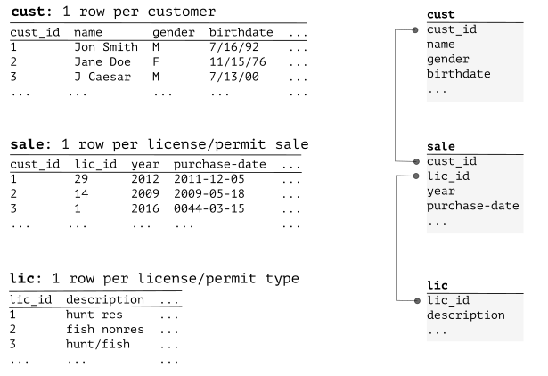

Dashboard Analyst Introduction
================
March 18, 2020

## Overview

Data dashboards provide a visual representation of hunting and fishing
license sales; summarizing both recent and long-term trends.
Participation metrics are presented for anglers and hunters as a whole
and also broken out over demographic groups, including residency,
gender, and age.

### Partial Snapshot of Tableau Dashboard


## Analyst Expectations

The data used to compile dashboards comes largely from state agency
databases; the analysis task involves preparing these idiosyncratic data
sources for dashboard production:

  - Connect to a Southwick server, accessed using Windows built-in VPN
    and Remote Desktop functionality.
  - Follow Southwick protocols to ensure security of sensitive data.
  - Adapt (or rewrite) template R scripts to process large data files
    (\~10+ million rows), utilizing available R resources to write and
    debug code.
  - Collaborate with project manager to accurately process/validate data
    and troubleshoot data challenges.

## Input: Raw License Data

State agencies provide raw license data, which is typically separated
into three related tables. A generic example:



### Data Processing Goals

  - Validate to ensure complete and accurate data
  - Summarize to get a sense for licensing trends and state-specific
    data peculiarities
  - Standardize to facilitate efficient workflows
  - Anonymize to remove sensitive information from production data
  - Create additional data categories to enable retrieval of customer
    trends

## Output: SQLite Database

The expected data processing output is superficially quite similar to
the data processing input, but is structured in a way which makes it
easy to extract participation metrics to build interactive dashboards:


## Example R Code

I’ve included some example R code (and output) below to give a sense of
what part of a workflow might look like:

  - Purpose: Ask a data question and answer using R
  - Question: How has the number of resident hunting licensed buyers
    changed year to year? In particular, what do the dynamics look like
    by age and gender?

<!-- end list -->

``` r
library(tidyverse)
library(DBI)

db_production <- "E:/SA/Data-production/Data-Dashboards/IA/license.sqlite3"
con <- dbConnect(RSQLite::SQLite(), db_production)

tbl(con, "sale") %>%
    glimpse()
```

    ## Observations: ??
    ## Variables: 11
    ## Database: sqlite 3.30.1 [E:\SA\Data-production\Data-Dashboards\IA\license.sqlite3]
    ## $ raw_sale_id <int> 8835408, 8835973, 8837039, 8838948, 8841802, 8845057, 8...
    ## $ cust_id     <dbl> 2366078, 990679052, 831167275, 745356, 248978520, 97217...
    ## $ lic_id      <int> 5, 5, 5, 5, 5, 5, 5, 5, 5, 5, 5, 5, 5, 5, 5, 5, 5, 5, 5...
    ## $ year        <int> 2013, 2013, 2013, 2013, 2013, 2013, 2013, 2013, 2013, 2...
    ## $ month       <int> 1, 1, 1, 1, 1, 1, 1, 1, 1, 1, 1, 1, 1, 1, 1, 1, 1, 2, 2...
    ## $ dot         <chr> "2013-01-02", "2013-01-02", "2013-01-02", "2013-01-03",...
    ## $ start_date  <chr> "2013-01-01", "2013-01-01", "2013-01-01", "2013-01-01",...
    ## $ end_date    <chr> "2016-01-10", "2016-01-10", "2016-01-10", "2016-01-10",...
    ## $ res         <int> 1, 1, 1, 1, 1, 1, 1, 1, 1, 1, 1, 1, 1, 1, 1, 1, 1, 1, 1...
    ## $ revenue     <dbl> 53, 53, 53, 53, 53, 53, 53, 53, 53, 53, 53, 53, 53, 53,...
    ## $ sale_period <chr> "2018-q4", "2018-q4", "2018-q4", "2018-q4", "2018-q4", ...

``` r
dbDisconnect(con)
```
